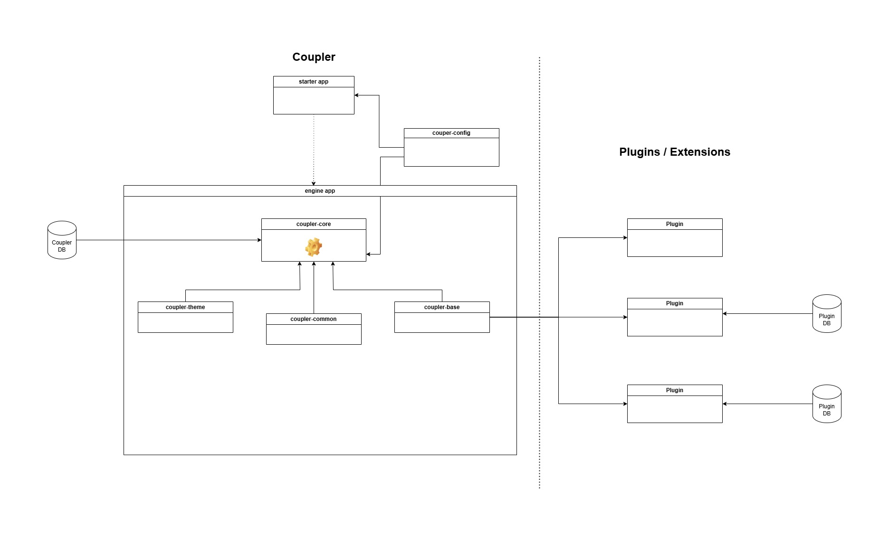

# PacOS
PacOS is a modern web application built using Java and the Vaadin framework, designed primarily for testing environments. It features a windowed interface, similar to most operating systems, where each plugin is represented as a separate window. This design enhances the user experience, making it more intuitive and user-friendly.

Each plugin is launched in a separate context, so the extension has no impact on the stability and startup of the system
itself. It also allows dynamic addition and removal of plugins in real time, just like in any operating system. Restart
is not required for plugin manipulation.
#### Docker image: https://hub.docker.com/r/pacosdev/webos

### Documentation https://pacos.dev

## Features
#### Single-user and Multi-user Modes: 
- PacOS supports both local single-user mode and multi-user mode for server-based environments.
#### Installer and Configuration Wizard: 
- The application comes with an intuitive installation wizard that guides users through the setup and configuration process.
#### Built-in Marketplace: 
- PacOS includes an integrated marketplace that allows users to customize the system according to their needs. Users can install and update modules directly from the marketplace.
#### Auto Update System: 
- PacOS features an automatic update system. When a new version is detected, users can update the system without requiring a manual deployment.
#### Plugin Management: 

- Plugins can be installed at any time, either from a remote repository or manually uploaded to the system. Plugin
  manipulation does not require a system restart.
#### Developer Support: 
- Along with the application, PacOS provides a skeleton application that allows developers to create custom extensions and plugins, enabling them to extend the system with additional functionality tailored to their specific needs.
Getting Started
To begin using PacOS, simply follow the step-by-step instructions provided by the installation wizard. Whether you're using it locally or in a server environment, the process is seamless and user-friendly. After installation, you can start customizing the system with plugins and explore its full potential.

# Development
## PacOS Module Diagram

#### starter-app
- This module manages the dependencies of the entire PacOS system and is responsible for starting up the application. It ensures that all necessary components are loaded and configured before the system is launched. The starter-app acts as the entry point for the PacOS system.

#### pacos-config
- The pacos-config module contains the global configuration of the system. This configuration is shared and accessible by both the starter-app module and the core PacOS system. It stores essential settings, such as system preferences and configuration parameters, ensuring consistent configuration throughout the application.

#### engine
- The engine module is a fat JAR file that contains all the basic components required for the system to function. It is responsible for initializing the PacOS system by launching the necessary services and preparing the environment for the core functionality. This module ensures that all required resources are available when the system starts.

#### pacos-core
- The pacos-core module contains the full functionality of the PacOS system. It includes the business logic, core features, and user-facing functionality. This module is the heart of the PacOS system, implementing all the primary features that users interact with. It is responsible for the overall operation of the application.

#### pacos-common
- The pacos-common module includes implementations that are commonly used by system plugins. It provides shared utility functions and components that plugins can leverage to interact with the system. This module ensures that plugins can access basic system features and operate smoothly within the PacOS environment.

#### pacos-base
- The pacos-base module provides the code necessary for integrating plugins with the PacOS system. It contains interfaces, classes, and tools that enable plugins to communicate with the core system and extend its functionality. This module serves as the foundation for building and integrating custom plugins within the PacOS ecosystem.

## Running the application
For development purpose on local env there is no need to use starter-app. 
Because the pacos is based on spring-boot, launch main class from engine module: `org.pacos.core.Application`

#### Production build
`mvn clean install -DworkingDir=/path/to/working/dir -Pproduction`

#### Report plugin 
`mvn clean install verify -DworkingDir=/path/to/working/dir --activate-profiles coverage-create-reports`

## Docker
### Export docker image
1. Build app in production mode `mvn clean install -Pproduction`
2. Go to starter module directory `cd starter`
3. Export image to file `docker save pacos > pacos.tar`
4. Pack to gzip `gzip pacos.tar`
5. load to docker registry `gunzip -c pacos.tar.gz | docker load`

### PacOS home directory on docker
By default, pacos is installed and initialized in the /pacos directory on the docker machine.
If you want to have pacos home dir outside docker container, replace home directory by mount host directory
- `docker run --mount type=bind,source=pat/to/file/on/host,target=/pacos -ti -p 8090:8090 pacos`

## Configuration of Your Own System Instance
To enable the automatic update functionality for both the PacOS system and its plugins, you need to configure your own remote Maven artifact repository (such as JFrog, Nexus, etc.). All PacOS system artifacts and plugins must be exported and made available in this repository for the system to be able to fetch and update them.

### Steps for Configuration
1. Set Up Your Maven Repository 
   - To enable automatic updates, set up a remote Maven repository (e.g., JFrog, Nexus, or any other Maven-compatible repository).
   - Ensure that all PacOS system artifacts, as well as any plugins, are exported to this repository. This is essential for the PacOS system to detect and download the latest versions of the system or plugins when updates are available.
2. Export Artifacts
   - All the PacOS system modules and any plugins must be exported to the configured Maven repository. This includes the core system JARs and any additional plugin modules.
   - For details on exporting these artifacts, refer to the Jenkinsfile which provides instructions on how to automate this process.
3. Configuration Files
   - The current version of the PacOS system/module is specified in the configuration files: modules.json and plugin.json.
     - modules.json: Contains the configuration and version information for the core PacOS system.
     - plugin.json: Contains configuration and version information for plugins within the system.
   - These files are crucial for the PacOS system to recognize and correctly update components. Make sure that the version numbers and other settings in these files are correctly specified and up-to-date.
4. Marketplace Integration
   - Once the system is configured with the Maven repository and the required configuration files, PacOS will use the marketplace to check for updates.
   - When you access the marketplace, PacOS will look for the modules.json and plugin.json files within the remote repository. It will adapt its behavior based on the content of these files. For example, if a new version is available, the system will prompt for an update.
   - The marketplace uses these files to determine what updates are available for the system and plugins, ensuring seamless management of the system’s components.

## Useful links
- PacOS documentation at [pacos.dev](https://pacos.dev)
- Vaadin documentation at [vaadin.com/docs](https://vaadin.com/docs).
- Vaadin tutorials at [vaadin.com/tutorials](https://vaadin.com/tutorials).
- Skeleton project for new plugins [pacos-skeleton](https://github.com/pacos-dev/skeleton)

## Release note

[release_note.txt](modules/pacos-core/src/main/resources/release_note.txt)