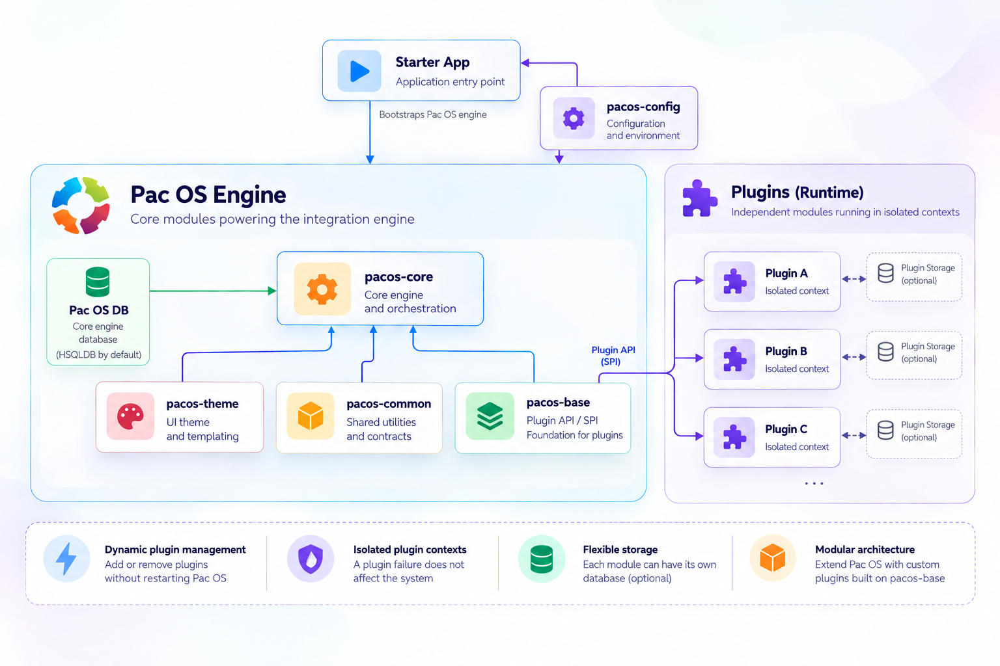

# PacOS

> A modular, web-based operating system for Java applications.

PacOS is a modern web application built with **Java**, **Spring Boot** and **Vaadin**.

It provides a desktop-like web environment where application functionality is delivered through independently managed plugins. Plugins can be installed, removed and updated at
runtime without restarting the PacOS system.

PacOS was originally designed with testing environments in mind, but its modular architecture makes it suitable for building extensible web-based applications and internal
platforms.



## Why PacOS?

Traditional web applications usually grow into a single large application where every new feature becomes part of the core.

PacOS takes a different approach:

- the core provides the platform and common functionality
- features can be delivered as independent plugins
- plugins are loaded into separate contexts
- plugins can be installed and removed at runtime
- the system does not need to restart when plugins change
- plugins can be distributed through a remote repository or uploaded manually
- plugins can communicate with others plugins and system
- system modules and plugins can be updated automatically
- the UI provides an operating-system-like window environment

This makes PacOS a good fit for applications that need to be **modular, extensible and dynamically configurable**.

---

## Features

### 🧩 Plugin Architecture

PacOS is built around a plugin-based architecture.

Each plugin represents an independent part of the system and is integrated through the PacOS plugin API.

Plugins can provide:

- backend functionality
- frontend views
- system events and listeners
- security permissions
- database configuration
- REST API documentation
- additional services and components

Plugins are loaded in their own context, helping prevent a plugin from affecting the startup and stability of the main system.

### 🔄 Runtime Plugin Management

Plugins can be:

- installed from a remote repository
- uploaded manually
- updated
- removed

Plugin management does not require restarting PacOS.

### 🪟 Window-Based User Interface

Each plugin can be represented as a separate window inside the PacOS desktop environment.

This provides a familiar operating-system-like experience while keeping functionality modular.

### 👤 Single-user and Multi-user Modes

PacOS supports:

- local single-user environments
- multi-user, server-based environments

### 🛒 Built-in Marketplace

PacOS includes an integrated marketplace for managing modules and plugins.

Users can discover, install and update available modules directly from the application.

### ⚡ Automatic Updates

PacOS can automatically detect newer versions of system modules and plugins.

Updates can be provided through a remote Maven-compatible artifact repository.

### 🧙 Installation and Configuration Wizard

PacOS provides an installation and configuration wizard that guides users through the initial setup of the system.

### 🛠️ Developer Skeleton

A dedicated skeleton project is available for creating new PacOS plugins.

The skeleton provides examples for:

- frontend views
- backend components
- Spring configuration
- security
- events and listeners
- database configuration
- API documentation
- plugin packaging

---

# Architecture

PacOS is composed of several layers responsible for bootstrapping the application, providing the core platform and integrating external plugins.

## Core Modules

| Module         | Responsibility                                               |
|----------------|--------------------------------------------------------------|
| `starter`      | Application entry point and dependency management            |
| `pacos-config` | Global PacOS configuration                                   |
| `engine`       | System runtime and initialization                            |
| `pacos-core`   | Core functionality, business logic and user-facing features  |
| `pacos-common` | Shared implementations and components used by system plugins |
| `pacos-base`   | Plugin API / SPI and integration foundation                  |

### `starter`

The `starter` module is the entry point of the PacOS application.

It manages dependencies required by the complete system and is responsible for starting the application with all required components.

### `pacos-config`

`pacos-config` contains global configuration shared by the starter and the PacOS core.

It provides common system configuration and settings required across the application.

### `engine`

The `engine` module contains the basic runtime components required to initialize PacOS.

It prepares the environment and launches the services required by the core system.

For local development, the `starter` module is not required. The Spring Boot application from the `engine` module can be launched directly.

### `pacos-core`

`pacos-core` is the heart of the PacOS platform.

It contains:

- core business logic
- system functionality
- user-facing functionality
- plugin management
- platform services
- desktop/window functionality

### `pacos-common`

`pacos-common` contains implementations and components commonly used by PacOS system plugins.

It provides shared functionality that can be reused by modules running inside the PacOS environment.

### `pacos-base`

`pacos-base` provides the foundation for plugin integration.

It contains the interfaces, classes and tools required for plugins to communicate with and extend the PacOS system.

Conceptually, `pacos-base` acts as the **Plugin API / SPI** between the PacOS platform and external modules.

---

# Plugin Architecture

The main extension point of PacOS is the plugin layer.

Each plugin is loaded into a separate context.

This allows PacOS to dynamically extend the system without requiring all functionality to be part of the core application.

A plugin can be installed from:

- a configured remote repository
- a manually uploaded artifact

Once installed, the plugin becomes part of the running PacOS environment without requiring a system restart.

---

# Plugin Development

PacOS provides a skeleton project that can be used as the starting point for new modules.

**Skeleton project:**

https://github.com/pacos-dev/skeleton

The skeleton is a template for applications that run inside PacOS. It uses **Vaadin 24** for the frontend and **Spring Boot 3** for the backend.

## Create a Plugin

The recommended workflow is:

```text
PacOS Skeleton
      │
      ▼
Implement plugin functionality
      │
      ├── Backend
      ├── Frontend
      ├── Security
      ├── Events / Listeners
      ├── Configuration
      └── Database
      │
      ▼
Build plugin
      │
      ▼
Create shaded JAR
      │
      ▼
Install into PacOS
      │
      ├── Upload through UI
      └── Maven repository
```

A plugin can be packaged as a shaded JAR containing the additional dependencies required by the module.

```bash
mvn clean package
```

The resulting artifact can then be imported into an existing PacOS instance through the UI or from a configured Maven repository.

---

# Plugin Project Structure

The skeleton project provides the following basic structure:

```text
org.pacos.plugin.<module>
│
├── config
│   └── Spring and database configuration
│
├── backend
│   └── Backend components
│
├── security
│   └── Permissions and security configuration
│
├── system
│   └── Events and listeners
│
└── view
    └── Frontend views
```

Spring scans the following package:

```text
org.pacos.plugin.<your.module.name>.config
```

This allows the plugin's Spring configuration to be integrated into the PacOS environment.

Static frontend resources such as JavaScript, CSS and images should be placed under:

```text
META-INF/resources
```

These resources are exposed by PacOS as static web resources.

---

# Database

PacOS modules can have their own independent database configuration.

The core system uses **HSQLDB** as the default database configuration.

This allows modules to keep their persistence concerns separated from the rest of the system rather than forcing every module to share the same database configuration.

---

# API Documentation

PacOS supports automatic API documentation for plugins.

The skeleton project generates API documentation during the integration-test phase.

The generated documentation is aggregated by PacOS and exposed through:

```text
/swagger-ui/index.html
```

This makes APIs provided by individual plugins discoverable from the running PacOS instance.

---

# Development

## Local Development

PacOS is based on Spring Boot.

For local development, the `starter` module is not required.

Run the main application class from the `engine` module:

```text
org.pacos.core.Application
```

This is the recommended approach when developing the PacOS system locally.

---

## Production Build

To create a production build:

```bash
mvn clean install -DworkingDir=/path/to/working/dir -Pproduction
```

---

## Test and Coverage Report

To run verification and generate coverage reports:

```bash
mvn clean install verify \
  -DworkingDir=/path/to/working/dir \
  --activate-profiles coverage-create-reports
```

---

# Docker

PacOS can also be packaged and run as a Docker image.

## Build the Image

Build PacOS in production mode:

```bash
mvn clean install -Pproduction
```

Go to the `starter` directory:

```bash
cd starter
```

Export the Docker image:

```bash
docker save pacos > pacos.tar
```

Compress the image:

```bash
gzip pacos.tar
```

The image can later be loaded into Docker with:

```bash
gunzip -c pacos.tar.gz | docker load
```

---

## PacOS Home Directory

By default, PacOS uses:

```text
/pacos
```

inside the Docker container as its home directory.

To persist the PacOS home directory outside the container, mount a host directory:

```bash
docker run \
  --mount type=bind,source=/path/to/file/on/host,target=/pacos \
  -ti \
  -p 8090:8090 \
  pacos
```

---

# Automatic Updates

PacOS supports automatic updates for both system modules and plugins.

To enable this functionality, a remote **Maven-compatible artifact repository** must be configured.

Examples include:

- JFrog
- Nexus
- other Maven-compatible repositories

The repository needs to contain the PacOS system artifacts and plugins that should be available for installation and updates.

## Update Configuration

The update mechanism uses:

```text
modules.json
plugin.json
```

### `modules.json`

Contains configuration and version information for the PacOS system modules.

### `plugin.json`

Contains configuration and version information for plugins.

PacOS uses these files together with the configured remote repository to determine which versions are available.

When a newer version is available, the marketplace can offer the corresponding update.

---

# Marketplace

The PacOS marketplace provides a central place for managing system modules and plugins.

Depending on the configured repository, users can:

- discover modules
- install plugins
- upload plugins
- update installed modules
- update plugins

The marketplace uses the configured artifact repository and module/plugin metadata to determine available versions.

---

# Technology Stack

PacOS is built primarily with:

- **Java**
- **Spring Boot**
- **Vaadin**
- **Maven**
- **HSQLDB** as the default core database
- **Docker** for containerized deployments

The plugin skeleton currently uses **Vaadin 24** and **Spring Boot 3**.

---

# Project Structure

The main repository is organized into the following modules:

```text
pacos/
│
├── engine/
├── modules/
├── pacos-bom/
├── pacos-config/
├── starter/
├── podman/
│
├── module-diagram.jpg
├── pom.xml
├── Jenkinsfile
├── Jenkinsfile-deploy
└── README.md
```

The repository also contains CI/CD configuration and deployment-related files.

---

# Useful Links

- **PacOS:** https://pacos.dev
- **PacOS GitHub:** https://github.com/pacos-dev/pacos
- **Plugin Skeleton:** https://github.com/pacos-dev/skeleton
- **Vaadin Documentation:** https://vaadin.com/docs
- **Vaadin Tutorials:** https://vaadin.com/tutorials

---

# Docker Image

The PacOS Docker image is available on Docker Hub:

https://hub.docker.com/r/pacosdev/webos

---

# License

See [LICENSE.md](LICENSE.md).
